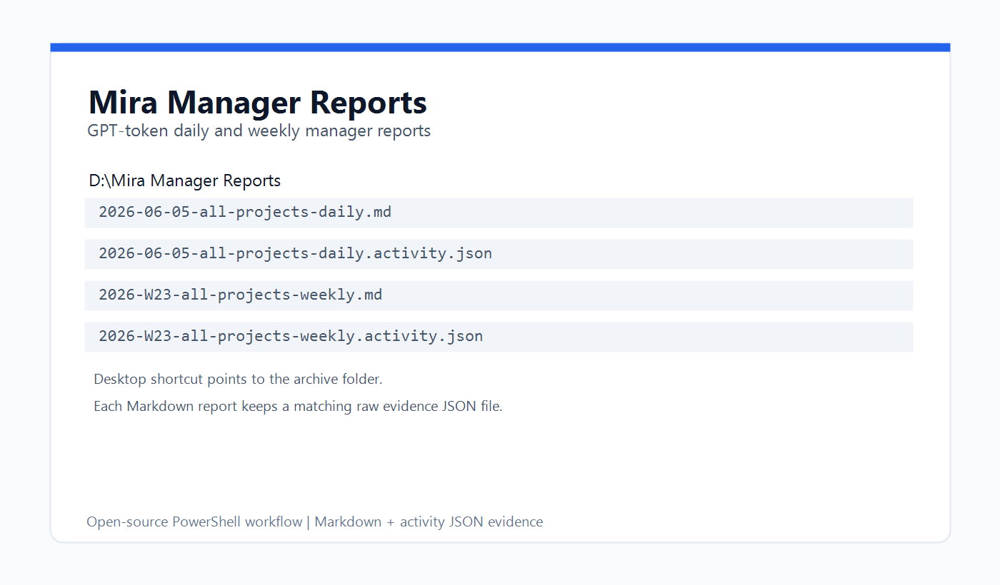
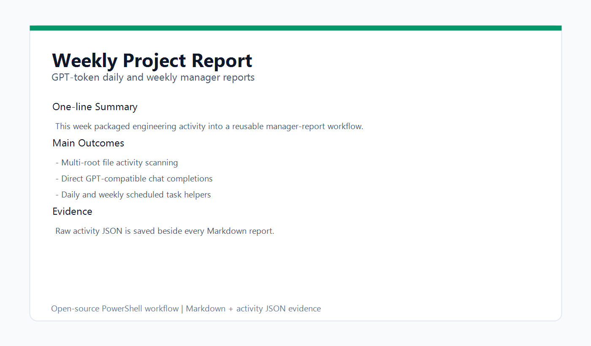

# Mira Manager Reports

Generate Chinese daily and weekly manager reports from local engineering activity, using a GPT-compatible token directly instead of launching an agent CLI.



## What It Does

- Scans one or more local project roots for recently changed files.
- Optionally includes git activity through `gitglimpse` if you wire it in.
- Sends the activity JSON to a GPT-compatible `/chat/completions` endpoint.
- Writes both the Markdown report and the raw `.activity.json` evidence file.
- Creates a desktop shortcut to the report archive folder.
- Installs daily and weekly Windows scheduled tasks.

Default Windows output folder:

```powershell
D:\Mira Manager Reports
```

Desktop shortcut:

```powershell
%USERPROFILE%\Desktop\Mira Manager Reports.lnk
```

## Example Output



See:

- [`examples/sample-daily-report.md`](examples/sample-daily-report.md)
- [`examples/sample-weekly-report.md`](examples/sample-weekly-report.md)
- [`examples/sample-activity.json`](examples/sample-activity.json)

## Quick Start

Set a token. The script never prints the token value.

```powershell
$env:MANAGER_REPORT_API_KEY = "your-token"
```

Run a daily report:

```powershell
.\ops\run-scheduled-project-report.ps1 `
  -Mode daily `
  -Root "D:\Work\project-a", "D:\Work\project-b" `
  -Since "yesterday"
```

Run a weekly report:

```powershell
.\ops\run-scheduled-project-report.ps1 `
  -Mode weekly `
  -Root "D:\Work\project-a", "D:\Work\project-b" `
  -Since "7 days ago"
```

Use another output folder:

```powershell
.\ops\run-scheduled-project-report.ps1 `
  -Mode daily `
  -Root "D:\Work\project-a" `
  -OutputDir "E:\Reports\Manager"
```

## Token And API Configuration

Token lookup order:

1. `MANAGER_REPORT_API_KEY`
2. `GPT55_PRO_API_KEY`
3. `MANAGER_REPORT_TOKEN_FILE`
4. `%USERPROFILE%\.manager-report-token`

Default API base:

```powershell
https://zzshu.cc/v1
```

Override it:

```powershell
.\ops\run-project-report.ps1 `
  -Root "D:\Work\project-a" `
  -ApiBase "https://api.openai.com/v1" `
  -Model "gpt-4.1"
```

## Install Scheduled Tasks

Run PowerShell as an administrator, or let the installer prompt for elevation:

```powershell
.\ops\install-report-scheduled-tasks.ps1 `
  -ScanRoot "D:\Work\project-a", "D:\Work\project-b" `
  -DailyTime "18:30" `
  -WeeklyTime "18:45"
```

The installer creates:

- `Mira Project Daily Manager Report`
- `Mira Project Weekly Manager Report`

## Offline Or CI Fallback

Generate deterministic Markdown without calling a model:

```powershell
.\ops\run-project-report.ps1 `
  -Mode daily `
  -Root "D:\Work\project-a" `
  -SkipGitActivity `
  -IncludeFileActivity `
  -ForceFallback
```

Generate only activity JSON:

```powershell
.\ops\run-project-report.ps1 `
  -Mode weekly `
  -Root "D:\Work\project-a" `
  -SkipGitActivity `
  -IncludeFileActivity `
  -RawOnly
```

## Tests

```powershell
.\ops\tests\test-report-file-activity.ps1
.\ops\tests\test-scheduled-report-direct-api-config.ps1
```

Parser smoke:

```powershell
$files = @(
  "ops\run-project-report.ps1",
  "ops\run-scheduled-project-report.ps1",
  "ops\install-report-scheduled-tasks.ps1"
)
foreach ($f in $files) {
  $tokens = $null
  $errors = $null
  [System.Management.Automation.Language.Parser]::ParseFile((Resolve-Path $f), [ref]$tokens, [ref]$errors) | Out-Null
  if ($errors.Count -gt 0) { throw "$f parse failed" }
}
```

## Security Notes

- Do not commit generated reports if they contain private file paths.
- Do not commit `.activity.json` from private repositories without review.
- Do not place tokens in scripts, logs, examples, or README snippets.
- The scripts redact bearer tokens from model error messages.

## License

MIT
